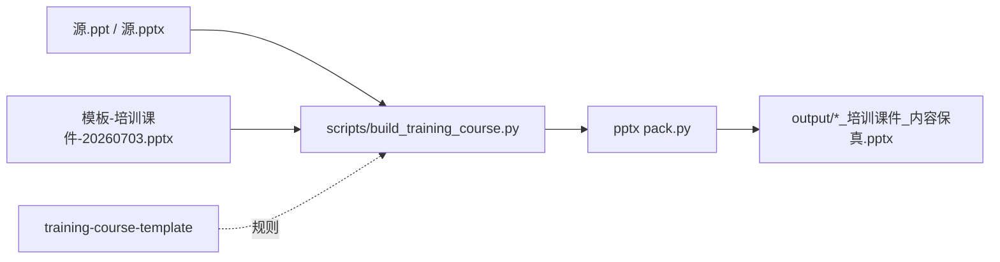

# 全流程文件与 Skill 说明

## Skill 是什么

**Skill** = 给 Agent 的可复用操作手册（不是可执行程序）。

本目录 [`SKILL.md`](SKILL.md) 规定：任意源课件 →「培训课件」风格（字/图保真，chrome 来自模板）。

配套：[`layouts.md`](layouts.md)、[`content-fidelity.md`](content-fidelity.md)、[`acceptance.md`](acceptance.md)。  
通用打包工具：`.claude/skills/pptx/`。

---

## 怎么生成下一章（例如第4章）

仓库已恢复**通用构建入口**（不绑死第3章）：

```bash
# 在仓库根目录执行（.ppt 会自动转 pptx，WMF 会尽量转 PNG）
python scripts/build_training_course.py "第4章 测距机.ppt"

# 或
python build_training_course.py "第4章 测距机.ppt"
```

输出默认：

`output/第4章 测距机_培训课件_内容保真.pptx`

指定输出：

```bash
python scripts/build_training_course.py "第4章 测距机.ppt" -o "output/第4章_测距机_培训课件_内容保真.pptx"
```

需要本机已装 **PowerPoint**（COM 转换 .ppt / WMF）和 Python 包 `python-pptx`、`pywin32`。

---

## 仓库文件分工

| 路径 | 作用 |
|------|------|
| `.claude/skills/training-course-template/` | Skill 规则（本目录） |
| `.claude/skills/pptx/scripts/` | unpack / clean / pack |
| `模板-培训课件-20260703.pptx` | 主题模板 |
| `第N章 ….ppt` | 各章内容真源 |
| `scripts/build_training_course.py` | **通用构建器**（套模板） |
| `scripts/image_geometry.py` | 从源 slide 抽图片几何 |
| `build_training_course.py` | 根目录转发入口 |
| `output/` | 交付物 |

运行时会生成（可事后清理，不影响再跑）：

- `*_converted.pptx`、`src_unpacked_*`、`media_png_*`、`work_*`

---

## 数据流



---

## 一句话

- **Skill** = 规则书  
- **模板** = 外观壳  
- **源课件** = 内容  
- **`scripts/build_training_course.py`** = 对任意章执行的引擎  
- **output/** = 结果  
